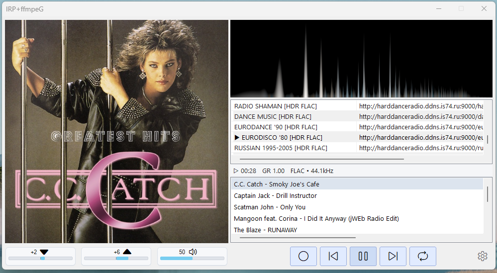

# IRPFFmpeg

IRPFFmpeg - настольный проигрыватель интернет-радио для Windows. Он воспроизводит сетевые аудиопотоки через FFmpeg, показывает текущий трек, загружает обложки, ведет историю и умеет записывать эфир в MP3 320 kbit/sec или FLAC.

Проект сделан как легкое Win32-приложение на C++17: без Electron, без браузерной оболочки, с отдельным загрузчиком для аккуратной работы с FFmpeg/SDL2 DLL.



## Возможности

- воспроизведение интернет-радио по URL;
- работа с M3U-плейлистом;
- добавление, удаление и переключение станций из интерфейса;
- отображение ICY/stream metadata и технического статуса потока;
- автоматический поиск и кэширование обложек;
- запись текущего эфира в `Rec`;
- экспорт записей в MP3 320 kbit/sec или FLAC;
- добавление метаданных и обложки в записанные файлы, когда данные доступны;
- регулировка громкости, баса и верхних частот;
- Stereo Width, Exciter, DeepBass, Dynamic Auto Volume, GainRider и финальный лимитер;
- сворачивание в системный трей;
- всплывающее окно с обложкой и названием трека при смене композиции в режиме трея;
- отдельный загрузчик `Start_IRPFFmpeg.exe`, который проверяет runtime DLL и запускает основное приложение.

## Быстрый запуск

Для обычного запуска используйте:

```text
Start_IRPFFmpeg.exe
```

`IRPFFmpeg.exe` лучше не запускать напрямую: основному приложению нужны библиотеки из папки `heap_dll`. Загрузчик проверяет наличие DLL, добавляет папку во временный `PATH` дочернего процесса и запускает плеер.

Минимальный состав релизной папки:

```text
Start_IRPFFmpeg.exe
IRPFFmpeg.exe
heap_dll/
  avcodec-62.dll
  avfilter-11.dll
  avformat-62.dll
  avutil-60.dll
  jpeg62.dll
  libpng16.dll
  SDL2.dll
  SDL2_image.dll
  swresample-6.dll
  swscale-9.dll
  turbojpeg.dll
  zlib1.dll
playlist.m3u
```

Обычному пользователю лучше скачивать полный архив IRPFFmpeg из GitHub Releases: в нем `heap_dll` уже должен быть собран и разложен правильно. Если собирать комплект вручную, используйте только x64 DLL и не смешивайте файлы из разных сборок.

Где взять DLL вручную:

- FFmpeg DLL (`avcodec`, `avfilter`, `avformat`, `avutil`, `swresample`, `swscale`) - с официальной страницы загрузки FFmpeg: https://ffmpeg.org/download.html. Сам проект FFmpeg публикует исходный код и дает ссылки на готовые Windows builds, например gyan.dev и BtbN. Нужна shared/dev x64-сборка с DLL из папки `bin`.
- `SDL2.dll` - из официальных архивов SDL2 для Visual C++: https://www.libsdl.org/release/. Обычно нужен архив вида `SDL2-devel-...-VC.zip`, внутри DLL лежит в `lib\x64`.
- `SDL2_image.dll` - из релизов SDL2_image: https://github.com/libsdl-org/SDL_image/releases. Берите Windows x64/VC-комплект, совместимый с вашей версией SDL2.
- `libpng16.dll`, `jpeg62.dll`, `turbojpeg.dll`, `zlib1.dll` - сопутствующие библиотеки изображений и сжатия. Обычно они уже идут в комплекте с SDL2_image/вашей сборкой зависимостей или могут быть получены через vcpkg (`x64-windows`). Для релиза используйте ровно те DLL, с которыми приложение было собрано и проверено.

Если загрузчик сообщает, что не хватает DLL, верните недостающие файлы в `heap_dll` или скачайте полный релизный архив заново.

Во время работы приложение может создать:

```text
app.dat         - настройки и состояние
Rec/            - записанные треки
cover_cache/    - кэш обложек
debug_log.txt   - диагностический лог, если включено логирование
```

## Сборка из исходников

Требования:

- Windows 10/11;
- Visual Studio 2022;
- MSVC toolset v143;
- Windows SDK 10;
- C++17;
- FFmpeg development package с `include`, `lib` и `bin`;
- SDL2 и SDL2_image.

Откройте `IRPFFmpeg.sln` в Visual Studio и соберите конфигурацию `Release|x64`.

В текущем проекте пути к зависимостям прописаны в `IRPFFmpeg.vcxproj`:

```text
D:\Code\ffmpeg-dev\include
D:\Code\ffmpeg-dev\lib
D:\Code\ffmpeg-dev\bin
C:\dev\vcpkg\installed\x64-windows\include\SDL2
C:\dev\vcpkg\installed\x64-windows\lib
```

Если зависимости лежат в другом месте, измените пути в свойствах проекта или в `.vcxproj`.

Подробная инструкция: [docs/BUILD.md](docs/BUILD.md).

## Структура проекта

```text
IRPFFmpeg.sln              - решение Visual Studio
IRPFFmpeg.vcxproj          - основное приложение
Start_IRPFFmpeg.vcxproj    - загрузчик приложения
IRPFFmpeg.cpp/.h           - Win32 UI, управление состоянием, воспроизведение
audio_dsp.cpp/.h           - обработка звука
file_recording.cpp/.h      - запись MP3/FLAC и метаданные
cover_art.cpp/.h           - поиск, загрузка и кэширование обложек
metadata_decode.cpp/.h     - декодирование текстовых метаданных
util.cpp/.h                - общие утилиты
docs/                      - документация для пользователей и разработчиков
```

Подробнее об устройстве: [docs/ARCHITECTURE.md](docs/ARCHITECTURE.md).

## Документация

- [Руководство пользователя](docs/USER_GUIDE.md)
- [Сборка проекта](docs/BUILD.md)
- [Подготовка релиза](docs/RELEASE.md)
- [Архитектура](docs/ARCHITECTURE.md)
- [Описание для GitHub](docs/GITHUB_REPOSITORY.md)
- [Участие в разработке](CONTRIBUTING.md)
- [История изменений](CHANGELOG.md)
- [Сторонние компоненты](THIRD_PARTY_NOTICES.md)
- [Авторы](AUTHORS.md)

## Публикация на GitHub

Репозиторий подготовлен как исходный код проекта. Бинарные файлы сборки, папки `x64/`, `.vs/`, временные настройки, кэш обложек и записи исключены через `.gitignore`.

Готовые EXE/DLL лучше публиковать не в git-истории, а через GitHub Releases. Инструкция по составу архива находится в [docs/RELEASE.md](docs/RELEASE.md).

## Лицензия

Код IRPFFmpeg распространяется под лицензией MIT. Подробности: [LICENSE](LICENSE).

MIT License разрешает использовать, изменять и распространять код, но требует сохранять copyright notice и текст лицензии в копиях или существенных частях кода.

Если вы используете код IRPFFmpeg в своем проекте, пожалуйста, по возможности укажите автора и источник:

```text
Uses code from IRPFFmpeg by AsSergjo: https://github.com/AsSergjo
```

Это просьба об уважительном упоминании автора, а не дополнительное ограничение сверх MIT License.

Сторонние компоненты распространяются на своих условиях:

- FFmpeg DLL - LGPL/GPL согласно конкретной сборке FFmpeg;
- SDL2 и SDL2_image - zlib license;
- остальные runtime-библиотеки - согласно их собственным лицензиям.

Подробности и релизные требования: [THIRD_PARTY_NOTICES.md](THIRD_PARTY_NOTICES.md).
