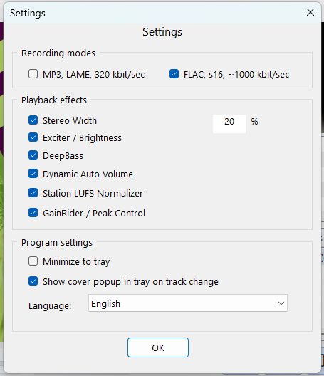

# IRPFFmpeg

[Russian version](README.md)

IRPFFmpeg is a desktop internet radio player for Windows. It plays network audio streams through FFmpeg, shows the current track, loads cover art, keeps playback history and can record broadcasts to MP3 320 kbit/sec or FLAC.

The project is a lightweight C++17 Win32 application: no Electron, no browser shell, with a separate launcher that prepares the FFmpeg/SDL2 DLL environment.




## Features

- play internet radio streams by URL;
- work with M3U playlists;
- add, delete and switch stations from the interface;
- show ICY/stream metadata and technical stream status;
- search, download and cache cover art;
- record the current broadcast to `Rec`;
- export recordings to MP3 320 kbit/sec or FLAC;
- write metadata and cover art to recordings when available;
- adjust volume, bass and treble;
- Stereo Width, Exciter, DeepBass, Dynamic Auto Volume, GainRider and final limiter;
- minimize to the system tray;
- show a cover/title popup on track change while the app is in the tray;
- choose the interface language: Russian or English;
- launch through `Start_IRPFFmpeg.exe`, which checks runtime DLLs and starts the main app.

## Quick Start

Run:

```text
Start_IRPFFmpeg.exe
```

It is better not to run `IRPFFmpeg.exe` directly: the main application needs libraries from the `heap_dll` folder. The launcher checks for DLLs, temporarily adds `heap_dll` to the child process `PATH` and starts the player.

Recommended download flow from GitHub Releases:

1. Download `IRPFFmpeg-v1.0.1-support-win-x64.zip`.
2. Extract it to a separate folder.
3. Download the current `IRPFFmpeg.exe` from the same release and place it next to `Start_IRPFFmpeg.exe`.
4. Run `Start_IRPFFmpeg.exe`.

The support archive contains libraries, the launcher, playlist, settings and language files. For small fixes, it is usually enough to replace only `IRPFFmpeg.exe`.

Minimal working folder layout after extracting the support archive and adding `IRPFFmpeg.exe`:

```text
Start_IRPFFmpeg.exe
IRPFFmpeg.exe
heap_dll/
  avcodec-62.dll
  avfilter-11.dll
  avformat-62.dll
  avutil-60.dll
  jpeg62.dll
  libpng16.dll
  SDL2.dll
  SDL2_image.dll
  swresample-6.dll
  swscale-9.dll
  turbojpeg.dll
  zlib1.dll
playlist.m3u
app.dat
Language/
  english.lng
  russian.lng
```

If you already have a working folder with `heap_dll`, `Language`, `playlist.m3u` and `app.dat`, updating usually means downloading the new standalone `IRPFFmpeg.exe` and replacing the old file.

If you assemble the package manually, use x64 DLLs only and do not mix files from different builds.

Where to get DLLs manually:

- FFmpeg DLLs (`avcodec`, `avfilter`, `avformat`, `avutil`, `swresample`, `swscale`) - from the official FFmpeg download page: https://ffmpeg.org/download.html. FFmpeg publishes source code and links to Windows builds such as gyan.dev and BtbN. You need a shared/dev x64 build and DLLs from its `bin` folder.
- `SDL2.dll` - from official SDL2 Visual C++ archives: https://www.libsdl.org/release/. Usually this is an archive like `SDL2-devel-...-VC.zip`; the DLL is inside `lib\x64`.
- `SDL2_image.dll` - from SDL2_image releases: https://github.com/libsdl-org/SDL_image/releases. Use a Windows x64/VC package compatible with your SDL2 version.
- `libpng16.dll`, `jpeg62.dll`, `turbojpeg.dll`, `zlib1.dll` - image/compression libraries. They are usually included with SDL2_image/your dependency bundle or can be obtained through vcpkg (`x64-windows`). For releases, use the exact DLLs that were built and tested with the app.

If the launcher reports missing DLLs, restore the missing files to `heap_dll` or download the full release archive again.

During runtime, the application may create:

```text
app.dat         - settings and state
Rec/            - recorded tracks
cover_cache/    - cover cache
debug_log.txt   - diagnostic log, if logging is enabled
```

## Building From Source

Requirements:

- Windows 10/11;
- Visual Studio 2022;
- MSVC toolset v143;
- Windows SDK 10;
- C++17;
- FFmpeg development package with `include`, `lib` and `bin`;
- SDL2 and SDL2_image.

Open `IRPFFmpeg.sln` in Visual Studio and build `Release|x64`.

The current project paths are configured in `IRPFFmpeg.vcxproj`:

```text
D:\Code\ffmpeg-dev\include
D:\Code\ffmpeg-dev\lib
D:\Code\ffmpeg-dev\bin
C:\dev\vcpkg\installed\x64-windows\include\SDL2
C:\dev\vcpkg\installed\x64-windows\lib
```

If your dependencies are in a different location, update the project properties or `.vcxproj`.

Detailed build instructions: [docs/BUILD.md](docs/BUILD.md).

## Project Structure

```text
IRPFFmpeg.sln              - Visual Studio solution
IRPFFmpeg.vcxproj          - main application
Start_IRPFFmpeg.vcxproj    - launcher application
IRPFFmpeg.cpp/.h           - Win32 UI, state management, playback
audio_dsp.cpp/.h           - audio processing
file_recording.cpp/.h      - MP3/FLAC recording and metadata
cover_art.cpp/.h           - cover search, download and caching
metadata_decode.cpp/.h     - text metadata decoding
language_manager.cpp/.h    - interface localization
util.cpp/.h                - shared utilities
Language/                  - interface localization files
docs/                      - user and developer documentation
```

Architecture details: [docs/ARCHITECTURE.md](docs/ARCHITECTURE.md).

## Documentation

- [User guide](docs/USER_GUIDE.md)
- [Build instructions](docs/BUILD.md)
- [Release preparation](docs/RELEASE.md)
- [Architecture](docs/ARCHITECTURE.md)
- [GitHub repository description](docs/GITHUB_REPOSITORY.md)
- [Contributing](CONTRIBUTING.md)
- [Changelog](CHANGELOG.md)
- [Third-party notices](THIRD_PARTY_NOTICES.md)
- [Authors](AUTHORS.md)

## GitHub Publishing

The repository is prepared as source code. Build outputs, `x64/`, `.vs/`, temporary settings, cover cache and recordings are excluded through `.gitignore`.

Ready EXE/DLL packages should be published through GitHub Releases, not stored in git history. See [docs/RELEASE.md](docs/RELEASE.md).

## License

IRPFFmpeg source code is distributed under the MIT License. See [LICENSE](LICENSE).

MIT License allows using, modifying and distributing the code, but requires preserving the copyright notice and license text in copies or substantial portions of the software.

If you use IRPFFmpeg code in another project, attribution is appreciated where practical:

```text
Uses code from IRPFFmpeg by AsSergjo: https://github.com/AsSergjo
```

This attribution request is not an additional restriction beyond the MIT License.

Third-party components are distributed under their own terms:

- FFmpeg DLLs - LGPL/GPL according to the exact FFmpeg build;
- SDL2 and SDL2_image - zlib license;
- other runtime libraries - according to their own licenses.

Details and release requirements: [THIRD_PARTY_NOTICES.md](THIRD_PARTY_NOTICES.md).
